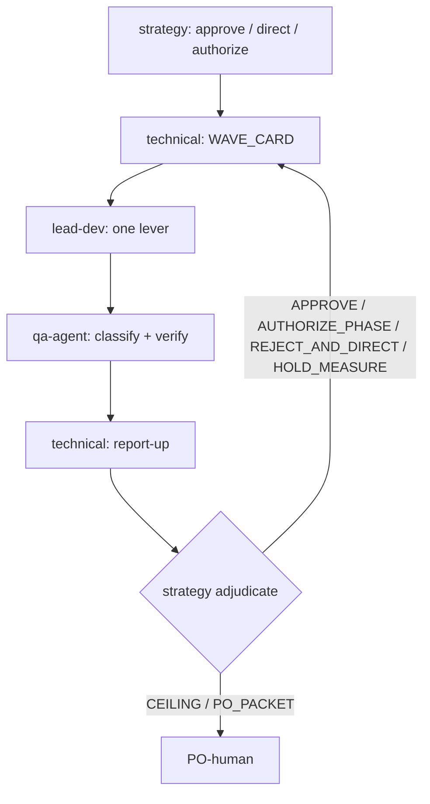

# Multi-Agent Orchestration — Executive Dashboard

Repo-wide contract for every signed campaign. One bounded arc → **SUCCESS** or
**CEILING**. Optimize for **PO-visible truth** (TV / tablet), not activity.

## 0. Progressive disclosure

| Trigger | Read |
|---------|------|
| Roles, loop, stop rules | this file |
| QA tier / browser / visual / crash | [QA-PROTOCOL.md](QA-PROTOCOL.md) |
| Machine evidence / run class / footers | [EVIDENCE-AND-FOOTERS.md](EVIDENCE-AND-FOOTERS.md) |
| Strategy PO-proxy / PO packets / models | [STRATEGY-AND-GOVERNANCE.md](STRATEGY-AND-GOVERNANCE.md) |

SSOT: `Documents/1-Sprints/<Campaign>/CAMPAIGN-STATE.md`  
Logs: `Documents/1-Sprints/<Campaign>/Agents Logs/`

**Destructive FS:** never `rmdir /s`, `robocopy /MIR`, or recursive-delete chrome profiles. Binding: `.cursor/rules/destructive-fs-guard.mdc`. Hygiene = gitignore/leave or `Move-Item -LiteralPath` outside the repo.

No campaign overlay by default. Do not load Zviewer P11* overlays from other repos.

---

## 1. Authority ladder

```text
PO-human Rules + signed authorized_box
  → strategy-advisor (adversarial PO-proxy)
    → technical-advisor (execution plan + report-up)
      → lead-dev (one lever) → qa-agent (independent verify)
  → orchestrator-router (dispatch / channel hygiene / stop)
```

Evidence precedence:

```text
PO-signed contract / authorized_box
  → current campaign raw evidence
  → current ADR
```

Only `lead-dev` edits production (`apps/**`, `src/**`, scoped packages).  
`iso-19650-reference` = CDE naming only. No campaign decisions.

---

## 2. Role contracts (binding)

### 2.1 `strategy-advisor` — adversarial PO-proxy

**Owns:** authorize/close boxes and phases inside signed cap · adjudicate raw evidence ·
reject weak claims · issue **TEAM_DIRECTIVE** so execution continues without PO · compose
PO-human packets only when scope truly needs PO.

**Must:**
1. Read `result.json` · `claims.yaml` · screenshots · run JSON **and pinned artifacts** **before** Agents Logs.
2. Extract ≥3 own claims from raw evidence.
3. Separate invalid env · product fail · product pass · `NOT_MEASURED`.
4. Challenge ≥1 team assumption.
5. Decide one of: `STRATEGY_APPROVE_EXECUTION` · `STRATEGY_REJECT_AND_DIRECT` · `STRATEGY_HOLD_MEASURE` · `STRATEGY_AUTHORIZE_PHASE` · `STRATEGY_CLOSE_CEILING` · `STRATEGY_PO_PACKET`.
6. On multi-stage bars: seat causal-layer skeleton before rem (`STRATEGY-AND-GOVERNANCE` §4.4).
7. On visual / 10-foot / KPI-on-screen / kiosk / PE vs Layer A: run **independent forensic** (`STRATEGY-AND-GOVERNANCE` §4.5). Produce a knockout number Layer A did not report. Quantify lever upper bound in the **same unit** as the remaining gap. Blind Layer A PASS is `NOT_MEASURED` for the product claim.

**Must not:** edit production · ask PO to ack technical next steps · send PO a packet while decisive metrics are `NOT_MEASURED` or Product Evidence falsifies the claim · rubber-stamp technical narrative · authorize a rem on qualitative “related widget” alone.

### 2.2 `technical-advisor` — execution planner

**Owns:** turn strategy directive into one `WAVE_CARD` · DoD · QA tier/class · regression ·
stop rule · post-QA **report-up** to strategy with honest gaps.

**Must:**
1. Copy `remaining_gap` / `lever_max_effect` / `ub_closes_gap` from strategy forensic into the WAVE_CARD **in the same unit**.
2. Name `pe_symptom` and `layer_a_must_catch` — gates that **fail** if the rem is wrong. If Layer A cannot see the PE symptom, set `measure_where: PRODUCT_BROWSER` (or BOTH) and `qa_tier` ≥ Q2.
3. After QA: `APPROVE-HANDOFF` only when the WAVE_CARD falsifier was measured. Layer A PASS + Layer B `N/A` on a visual/kiosk/KPI-on-screen wave → `REPORT-UP-STRATEGY`, not seat.

**Must not:** authorize architecture/bar/scope · message PO-human · open next phase because “sequence says so” · hide `NOT_MEASURED` as PASS · edit production · hand off a Q1-only wave as product seat when `pe_symptom` is visual/kiosk/KPI-on-screen.

### 2.3 `lead-dev` — one causal lever

**Owns:** implement `one_allowed_lever` or observe-only extract · self-test · machine triad · changelog for behavior change.

**Must:** execute the WAVE_CARD falsifier in `measure_where`. Vitest/eslint does **not** clear a TV visual / kiosk / on-screen KPI falsifier. `self_test_covers_pe_symptom: false` → STOP to technical; do not `defer_qa` as SHIPPED.

**Must not:** change bars/box · bundle a second lever · claim product PASS · patch campaign state · treat lint + Layer A as product PASS · compute KPI in the frontend.

### 2.4 `qa-agent` — independent verifier

**Owns:** env preflight · product fingerprint · claim verify · Layer A/B · `run_class` · `attempt_outcome` · Product Evidence decision.

**Must:** refuse overall PASS when (a) Product Evidence contradicts the claim, (b) the WAVE_CARD falsifier was not measured, (c) `measure_where` includes PRODUCT_BROWSER but Layer B is `N/A`/`ENV-BROWSER-SKIP`, (d) tab crash / blank wall → `PRODUCT-LOAD-CRASH` even if Layer A passed.

**Must not:** edit production · rescue by flags/mock · drop valid product failures · overall PASS when Product Evidence contradicts the claim · seat Q1 as product for visual/kiosk/KPI-on-screen.

### 2.5 `orchestrator-router` — channel hygiene

**Owns:** preflight · dispatch order · footer validation · stop wrong escalations.

**Stop if:** technical tries to escalate PO for a team-fixable gap · strategy emits `STRATEGY_PO_PACKET` while decisive falsifier is `NOT_MEASURED` · strategy emits `STRATEGY_APPROVE_EXECUTION` on a product rem while §4.5 binds and `independent_forensic` is missing or `ub_closes_gap` is not true · lead codes with owner UNKNOWN (unless OBSERVE_ONLY) · phase opens without required strategy approve.

### 2.6 `iso-19650-reference`

CDE naming only. No campaign decisions.

---

## 3. Campaign activation

```yaml
campaign_mode:
  RESEARCH_DRAFT:
    code_authorized: false
    allowed: [analysis, plan, evidence review]
  SIGNED_CAMPAIGN:
    requires:
      - authorized_box
      - product_outcome
      - retained_bars
      - scope_in_and_out
      - attempt_cap
      - stop_rules
      - QA_plan
```

Missing signed authority for behavior change → **STOP**.  
Draft in `0 - Documents/**` or `Documents/0-Draft/**` ≠ authorize.

```yaml
authorized_box: <id>
product_outcome: "<what leadership sees or can do on TV/tablet>"
bars: {}
kpi_contract: {}
scope_in: []
scope_out: []
phase_order: []
attempt_cap: {}
qa_plan:
  tier: Q0 | Q1 | Q2 | Q3
  batch: solo | wave:<id>
  bake_policy: none | verify_sha | rebake_if_source_changed
stop_rules: []
```

### 3.1 Outcome-wide programs

An `authorized_box` may cover a broad product outcome (e.g. Tab 1 live CDE). That does not weaken the one-lever wave contract:

```text
broad box → complete multi-layer plan + autonomous measured routing
one WAVE_CARD → one falsifiable causal lever
```

---

## 4. Default execution loop



Max **3 measured attempts** per lever class unless the box is tighter.  
`NOT_MEASURED` does **not** consume an attempt.

Mechanical `ADVANCE_SHORT` inside an already strategy-approved micro-stage may skip a fresh strategy call. Phase gates, product claims, evidence gaps, and checkpoints always return to strategy.

### 4.1 Micro-wave (observe-only fast path)

An **observe-only** wave (≤3 cycles · `behavior_change: false` · probes already defined) may skip the separate technical WAVE_CARD when the strategy directive itself names the probes, bound, and falsifier. Any behavior change, new instrument, or product claim returns to the full loop.

---

## 4.5 Execution efficiency (binding)

1. **Batch probes.** Every cold product cycle records **all** active P0 probes (KPI strip + no-scroll + stale badge + tab switch), not one metric per wave.
2. **Instrument self-test gate.** A new hook must be proven **non-null in a lead warm run** before QA spends a cold cycle. Unverified instrument → `NOT_MEASURED`.
3. **Intermittent failures use perturbation, not repetition.** See [QA-PROTOCOL.md](QA-PROTOCOL.md) §12 — never more than one identical-condition repeat.
4. **Bisect, don't peel.** Isolating a breaker inside a tab/widget stack halves the stack per wave.
5. **Log budgets.** Strategy body ≤ ~6 KB ([STRATEGY-AND-GOVERNANCE.md](STRATEGY-AND-GOVERNANCE.md) §4.1); technical WAVE_CARD ≤ ~4 KB; QA logs summarize.
6. **Cost-aware QA sizing.** Prefer fewer, information-dense cycles over identical repeats.
7. **Independent knockout before rem.** Strategy must not authorize a product rem whose remaining gap and lever max-effect were never measured in the **same unit** this turn.

---

## 4.6 Wrong-first rem (binding)

Do not spend a class on the **symptom's neighbor**. First measure the physical owner:

| PE symptom | First knockout (same unit) | Forbidden first rem |
|------------|----------------------------|---------------------|
| Số KPI lệch nguồn | BFF formula vs CDE/ERP fixture | màu widget, chart type |
| TV 1080p bị cuộn | overflow audit (px beyond 1080) | animation / glass |
| Chữ không đọc được từ 3 m | computed font vs 10-foot table | nhồi thêm dòng bảng |
| Widget trống / stale im lặng | `generatedAt` vs refresh TTL | skeleton polish |
| Kiosk treo / không xoay tab | timer + Redux kiosk state | Framer Motion |
| Gói lệch bản đồ | GeoJSON id vs package id | marker color |
| Layer A PASS, PE FAIL | name the gate Layer A cannot see | another rem in the same class |

CSS cannot close a formula gap. Mock data cannot close a live-CDE gap.

---

## 5. WAVE_CARD (before code)

Technical writes; strategy may reject.

```yaml
WAVE_CARD:
  directive_id: <from strategy> | n/a
  wave_id: <id>
  product_problem: "<PO-visible failure>"
  pe_symptom: "<what leadership sees: wrong KPI | scroll | unreadably small | blank TV | …>"
  measured_owner: "<phase/component>" | UNKNOWN
  hypothesis: "<causal, falsifiable>"
  remaining_gap: "<n unit>"
  lever_max_effect: "<n unit>"
  ub_closes_gap: true | false
  prediction:
    metric: <name>
    expected_range: <range>
    written_before_measurement: true
  falsifier: "<observation that proves hypothesis wrong>"
  layer_a_must_catch: []
  measure_where: NODE | PRODUCT_BROWSER | BOTH
  one_allowed_lever: <single causal change> | OBSERVE_ONLY
  theoretical_upper_bound: "<n unit — same as remaining_gap>"
  contracts_at_risk: [kpi-bff, ten-foot, kiosk, live-vs-mock, gis]
  qa_tier: Q0 | Q1 | Q2 | Q3
  regression_scope: []
  attempt_number: <n>/<cap>
  stop_rule: "<when to stop this class>"
```

Rules:

1. `UNKNOWN` owner → observe-only, not a product fix.
2. No prediction + falsifier → no code.
3. One wave = one causal lever.
4. Write prediction before reading the result; append actual/delta afterward.
5. Skip a lever whose upper bound cannot close the gap or that breaks a retained contract.
6. `ub_closes_gap` must be `true` for a product rem.
7. If `pe_symptom` is visual / kiosk / KPI-on-screen → `measure_where` is not NODE-only and `qa_tier` is not Q1.
8. `layer_a_must_catch` empty on a KPI/formula rem → strategy/orchestrator STOP.

---

## 6. Run validity and attempt accounting

```yaml
run_class:
  INVALID_ENVIRONMENT_RUN: precondition failed before product navigation
  PRODUCT_FAILURE_RUN: valid product-equivalent runtime, bar failed
  PRODUCT_PASS_RUN: valid product-equivalent runtime, bar passed

attempt_outcome:
  PASS: consumes_attempt
  FALSIFIED: consumes_attempt
  NOT_MEASURED: does_not_consume_attempt
```

- Invalid env runs are not product evidence.
- Valid product failures must count; never drop as outliers.
- Restarting the stack = environment recovery, never product remediation.
- Qualification fingerprint must equal product-default fingerprint.
- Harness/instrument failure → `NOT_MEASURED`, repair measurement, do not spend cap.

Details: [EVIDENCE-AND-FOOTERS.md](EVIDENCE-AND-FOOTERS.md).

---

## 7. When strategy MUST enter

Call strategy when **any** is true:

| Trigger | Why |
|---------|-----|
| Phase/box authorize or close | PO-proxy authority |
| Report-up after QA on phase gate / checkpoint / Q2+ product claim | Adversarial review |
| Evidence conflict or Product Evidence vs claim mismatch | Protect PO |
| Owner MEDIUM/UNKNOWN after a measurement wave | Direction |
| Same class ≥2 levers or ≥3 measured attempts | Anti-grind / ARG |
| Cap spent / definition / KPI / bar change | Scope |
| Team requests route after inconclusive / ceiling-partial | Prevent silent continue |
| PO explicitly asks for strategic review | External |

**Do not** call strategy for: pure self-test green with no product claim · drafting a WAVE_CARD after a clear `STRATEGY_APPROVE_EXECUTION` · mechanical ADVANCE_SHORT inside an already approved micro-stage.

---

## 8. Technical report-up (never to PO)

```yaml
TECHNICAL_REPORT:
  wave_id:
  directive_id:
  claimed_outcome:
  raw_evidence_paths: []
  run_classes: []
  attempt_outcomes: []
  open_gaps: []
  recommendation: APPROVE | REJECT_SELF | NEED_STRATEGY
  never: send_to_PO
```

Technical may self-loop only for measurement repair already directed by strategy, or ADVANCE_SHORT inside an approved micro-stage.

---

## 9. Evidence quality gate (before any PO packet)

```yaml
PO_PACKET_PRECHECK:
  decisive_metrics_measured: true
  product_evidence_supports_claim: true
  run_class_valid_for_product_claim: true
  product_fingerprint_equivalent: true
  open_NOT_MEASURED_on_decision_metric: false
  technical_options_to_PO: false
```

Fail → `STRATEGY_REJECT_AND_DIRECT` (team), **never** PO.

| Layer | Role |
|-------|------|
| Product evidence | decides (URL · fingerprint · 1080p screenshot · KPI vs fixture · kiosk) |
| Engineering evidence | explains (tests · Lighthouse · heap · SHA) |

Example: claim `KPI khớp nguồn tại t` **fails** if the screenshot at `t` shows mock placeholder.

---

## 10. Definition and architecture gate

Before every lever:

1. Failure = implementation, measurement, definition, or architecture?
2. KPI denominator physically defined (not swapped OTS↔TAT silently)?
3. If the lever passes, what improves for leadership on TV?
4. Targets measured owner and materially closes the gap?
5. How many measured attempts and lever classes already spent?

| Result | Action |
|--------|--------|
| Measurement invalid | `STRATEGY_HOLD_MEASURE` / repair |
| Wrong definition/denominator/bar | escalate strategy → possibly PO scope |
| Same symptom ≥2 classes or ≥3 measured cycles | ARG / strategy |
| Lever cannot materially improve product | skip or Ceiling |
| One owner + one falsifiable lever | LEVER |

---

## 11. Regression and QA batching

| Change | Minimum regression |
|--------|--------------------|
| Docs/schema/observe-only | Q0/Q1 |
| Loader/error/stale handling | Q1 + Q2 product spot |
| Kiosk / rotation / SSE | **load + tab-switch + 10-foot** |
| KPI / ETL / BFF formula | Q1 + Q2 number-on-screen |
| Layout / glass / grid | no-scroll + type scale + widget cap |

Default QA: wave-batch Q0/Q1 → one adjudication; Q2 spot when behavior risk; Q3 once at product exit.  
Details: [QA-PROTOCOL.md](QA-PROTOCOL.md).

---

## 12. PO-human channel (strict)

Only:

1. Success Packet
2. Ceiling Packet
3. PO Visual after QA PASS
4. Signed **scope** checkpoint (bar / KPI definition / product envelope) — **not** “ack next technical phase”

Forbidden to PO: Option A/B/C · harness rem · “ack Lx→Ly” · dump logs · Lighthouse-as-pass before visual.

Telegram only after `STRATEGY_PO_PACKET`: short VN `Kết quả` + `PO cần`.

Ceiling closes the **current arc/lever set**. It is not a permanent product ceiling unless the packet proves and PO accepts that broader scope.

---

## 13. State ownership

| Agent | May patch `CAMPAIGN-STATE.md` |
|-------|-------------------------------|
| lead-dev / QA | never |
| technical-advisor | routing only |
| strategy-advisor | box, PO decisions, freeze/close, directives |
| PO-human | all fields |

Log: `NNN. <role>-<topic>-YYYY-MM-DD.md`; next prefix = max + 1.

---

## 13.5 Hang / empty-return recovery (orchestrator)

When `Task` is **interrupted**, returns **empty**, or exceeds soft wall-clock (see `.cursor/rules/agent-hang-watchdog.mdc`) without a new Agents Log / `result.json`:

1. Classify `AGENT_HANG` (env/process) — **not** product FAIL and **not** a PO ask.
2. Prefer **slice** the remaining work (one tab, Layer A only).
3. Re-dispatch immediately (`resume` once, else new Task with next log id).

Never re-launch the identical unbounded mega-Task after a hang. Never hold a Task for 24h kiosk soak.

---

## 14. Stop conditions

Stop the tactical arc when any applies:

- no signed authority for behavior change;
- owner unknown but product fix requested;
- same hypothesis repeated without a new discriminator;
- three **measured** attempts spent in one lever class;
- box cap spent;
- definition/architecture conflict unresolved;
- valid product crash remains open;
- product fingerprint differs from default (mock labeled as live);
- bar or KPI contract would be weakened;
- required footer/machine evidence missing;
- PO packet attempted while `PO_PACKET_PRECHECK` fails;
- WAVE_CARD product rem missing `ub_closes_gap: true` or `pe_symptom` / `measure_where`;
- Q2 visual dispatched while `product_load_crash: OPEN` unless this wave **is** crash-class;
- lead `self_test_covers_pe_symptom: false` then QA dispatched as if SHIPPED.

Do not stop merely because an environment run was invalid — classify `NOT_MEASURED`, repair measurement, preserve attempt budget.

---

## 15. Dispatch

```text
lead-dev / qa-agent / technical-advisor / orchestrator / iso
  → omit model=

strategy-advisor
  → gated model ladder; fallback peer → down-tier → omit model= (Auto)
```

Profiles: `.cursor/agents/*.md`.  
Footers: [EVIDENCE-AND-FOOTERS.md](EVIDENCE-AND-FOOTERS.md).
