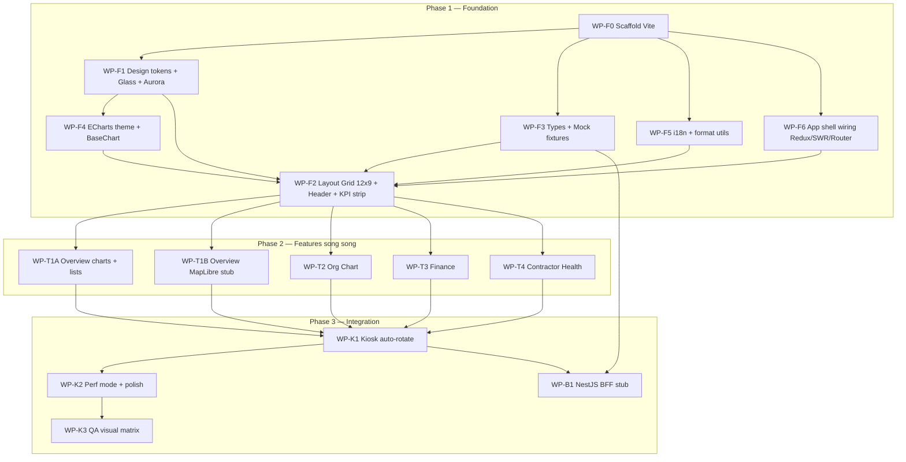

# Kế hoạch triển khai Multi-Agent — Executive Dashboard (V0)

| Thuộc tính | Giá trị |
|---|---|
| Ngày | 2026-08-19 |
| Nguồn SSOT thiết kế | `0 - Documents/1 - ThaoLuan/V0/PHAN-TICH-THIET-KE-DASHBOARD.md` |
| Trạng thái | **RESEARCH DRAFT** — chưa mở `authorized_box` · chưa authorize code |
| Mục tiêu demo sớm | Shell + 4 tab mock @1920×1080, không cuộn, glass + KPI strip |
| Root code đề xuất | `frontend/` (ưu tiên) · `backend/` (Phase 3+) |

> **Cổng PO (bắt buộc trước khi scaffold):** Research ≠ authorize. Agent chỉ được tạo `frontend/**` sau khi PO ký campaign trong `Documents/1-Sprints/` với `authorized_box`, `product_outcome`, `bars`, `attempt_cap`. Tài liệu này là kế hoạch quan sát — không phải lệnh code.

---

## 0. Nguyên tắc điều phối

1. **Tối đa 5–7 agent song song / phase** — tránh tranh file.
2. **Một WP = một owner folder** — không hai agent cùng sửa `shared/` trừ WP nền tảng tuần tự.
3. **Mock-first** — mọi Service đọc mock có shape `IApiResponse<T>` giống API §12; không tự tính KPI trên FE (số đã “nướng” trong mock / sau này BFF).
4. **Visual first @1080p** — nghiệm thu phase = mắt PO trên TV (font ≥18px, không cuộn), không lấy Lighthouse làm PASS sản phẩm.
5. **Map agent type Cursor Task ↔ vai trò campaign:**

| Cursor Task `subagent_type` | Khi nào | Vai trò campaign (sau khi ký) |
|---|---|---|
| `shell` | scaffold, deps, scripts | lead-dev (init) |
| `generalPurpose` | feature/widget implementation | `lead-dev` |
| `explore` | đọc V0 / tìm type / audit structure | hỗ trợ preflight |
| — | WAVE_CARD / DoD | `technical-advisor` |
| — | visual 1080p / KPI spot | `qa-agent` |
| — | authorize phase / adjudicate | `strategy-advisor` |

---

## 1. Sơ đồ phụ thuộc (toàn chương trình)



**Thứ tự cứng:** `F0` → (`F1`∥`F3`∥`F5`∥`F6`) → (`F4` sau F1) → `F2` (gộp) → 5 WP Phase 2 song song → `K1` → `K2` → `K3` · `B1` có thể song song `K2` nếu không đụng FE.

**Demo sớm nhất có thể (critical path):** F0 → F1+F3 → F2 → T1A (Tab 1 không map) → K1 tối thiểu. Ước lượng wall-clock agent: **1–2 ngày** nếu 5–6 agent chạy tốt.

---

## 2. Cấu trúc thư mục mục tiêu

```text
e:\0-Development\Dashboard\
├── 0 - Documents/                    # đã có (V0)
├── Documents/1-Sprints/<Campaign>/   # sau khi PO ký
├── frontend/                         # React 18 + Vite + TS
│   ├── package.json
│   ├── vite.config.ts
│   ├── tailwind.config.ts
│   ├── tsconfig.json
│   ├── index.html
│   ├── public/
│   └── src/
│       ├── app/
│       ├── features/{overview,orgChart,finance,contractorHealth,kiosk}/
│       ├── shared/
│       ├── locales/{vi,en}/
│       ├── styles/
│       ├── mocks/                    # fixtures JSON + loaders
│       └── main.tsx
└── backend/                          # NestJS — Phase 3+
    └── ...
```

Alias: `@/*` → `src/*`.

---

## 3. Phase 1 — Foundation

**Product outcome Phase 1:** Mở `http://localhost:5173` @ viewport 1920×1080 thấy dark + aurora + glass shell, 4 tab chuyển được (placeholder page), KPI strip 6 card mock, lưới 12×9 đúng kích thước ô, không cuộn, chữ ≥18px, i18n `vi`.

### 3.1 Danh sách Work Packages

#### WP-F0 — Scaffold frontend

| Trường | Nội dung |
|---|---|
| Mô tả | Khởi tạo Vite + React 18 + TS, Tailwind 3, path alias `@`, ESLint/Prettier tối thiểu, script `dev`/`build`/`preview` |
| Input | Không (blocker đầu) |
| Output | `frontend/package.json`, `vite.config.ts`, `tsconfig.json`, `tailwind.config.ts`, `index.html`, `src/main.tsx`, `src/App.tsx` stub |
| Phức tạp | **S** (0.5–1h) |
| Agent | `shell` → rồi `generalPurpose` nếu cần chỉnh config |
| Phụ thuộc | — |
| Song song | Không — chạy một mình trước |

#### WP-F1 — Design system (tokens + glass + aurora + fonts)

| Trường | Nội dung |
|---|---|---|
| Mô tả | CSS variables + Tailwind extend theo §10; `AuroraBackground`; `GlassPanel` L1/L2; `glass.css`; tải Be Vietnam Pro + JetBrains Mono; `--perf-mode` class sẵn |
| Input | WP-F0 |
| Output | `src/styles/globals.css`, `src/styles/glass.css`, `src/shared/constants/COLOR_TOKENS.ts`, `src/shared/components/layout/AuroraBackground.tsx`, `src/shared/components/glass/{GlassPanel,GlassCard}.tsx` |
| Phức tạp | **M** |
| Agent | `generalPurpose` |
| Song song với | F3, F5, F6 |

#### WP-F3 — Types + Mock fixtures (API-shaped)

| Trường | Nội dung |
|---|---|
| Mô tả | Port types §12.2; `IApiResponse`; mock JSON đủ 4 tab + KPI; loader `loadMock<T>(path)`; cờ `VITE_DATA_ARM=mock` |
| Input | WP-F0 |
| Output | `src/shared/types/{common,api}.types.ts`, `src/features/*/types/*.types.ts`, `src/mocks/**/*.json`, `src/mocks/loadMock.ts` |
| Phức tạp | **M** |
| Agent | `generalPurpose` |
| Song song với | F1, F5, F6 |
| Ràng buộc | Số trong mock đã format sẵn; **không** để FE tự công thức KPI |

#### WP-F5 — i18n + format utils

| Trường | Nội dung |
|---|---|
| Mô tả | i18next mặc định `vi`; namespaces `common,overview,orgChart,finance,health`; `formatCurrency` / `formatPercent` / `formatDate` / `getStatusColor` theo §10.7 |
| Input | WP-F0 |
| Output | `src/locales/**`, `src/app/providers/I18nProvider.tsx`, `src/shared/utils/format*.ts`, `getStatusColor.ts` |
| Phức tạp | **S–M** |
| Agent | `generalPurpose` |
| Song song với | F1, F3, F6 |

#### WP-F6 — App wiring (Redux + SWR + Router)

| Trường | Nội dung |
|---|---|
| Mô tả | Store RTK + `kioskSlice` stub; SWR provider; router 4 route tab; `HttpService` đọc mock khi `DATA_ARM=mock` |
| Input | WP-F0 |
| Output | `src/app/store.ts`, `hooks.ts`, `router.tsx`, `providers/*`, `shared/services/HttpService.ts`, `features/kiosk/slices/kioskSlice.ts` |
| Phức tạp | **M** |
| Agent | `generalPurpose` |
| Song song với | F1, F3, F5 |

#### WP-F4 — ECharts dark theme + chart primitives

| Trường | Nội dung |
|---|---|
| Mô tả | `echartsDarkTheme.ts` map color tokens; `BaseChart`; skeleton `SCurveChart`, `BulletChart`, `WaterfallChart`, `TreemapChart`, `RadarChart`, `HeatmapChart` (API props, có thể empty series) |
| Input | WP-F0 + WP-F1 (tokens) |
| Output | `src/shared/components/charts/**` |
| Phức tạp | **M** |
| Agent | `generalPurpose` |
| Song song với | F2 (sau khi F1 xong) — ưu tiên xong trước F2 nếu có slot |

#### WP-F2 — Layout shell (Grid 12×9 + Header + KPI)

| Trường | Nội dung |
|---|---|
| Mô tả | `DashboardShell`, `AppHeader`, `TabNavigation`, `DashboardGrid` (col 143px / row 96px math §3.3), `WidgetContainer` 4 trạng thái, `KpiStrip` + `KpiCard` + `DeltaBadge`; 4 page placeholder trong grid |
| Input | F1 + F3 + F5 + F6 (+ F4 nếu sẵn) |
| Output | `src/shared/components/layout/**`, `glass/WidgetContainer.tsx`, `kpi/**`, `feedback/**`, 4 `*Page.tsx` placeholder, `GRID_LAYOUT.ts` |
| Phức tạp | **L** |
| Agent | `generalPurpose` (+ `qa-agent` smoke sau) |
| Song song | Không — điểm hội tụ Phase 1 |

### 3.2 Wave song song Phase 1 (max 4 sau F0)

```text
Wave P1-A:  [F0]  (1 agent)
Wave P1-B:  [F1] [F3] [F5] [F6]  (4 agents)
Wave P1-C:  [F4] [F2]  — F4 start ngay khi F1 merge; F2 start khi F1+F3+F5+F6 merge
```

### 3.3 Checklist nghiệm thu Phase 1

- [ ] `npm run dev` lên được; `npm run build` PASS
- [ ] Viewport 1920×1080: **không** xuất hiện scrollbar trên shell
- [ ] Font Be Vietnam Pro + JetBrains Mono; không chữ < 18px trên TV mode
- [ ] Aurora 3 blob + glass L1 nhìn thấy rõ (không nền phẳng)
- [ ] Color tokens khớp hex §10.2
- [ ] Lưới: đo 1 ô ≈ 143×96 (+ gutter 14); header 72px; padding ngoài 24px
- [ ] 4 tab chuyển; KPI strip 6 card từ mock; timestamp `generatedAt` / `sourceSyncedAt` hiện
- [ ] Locale mặc định tiếng Việt
- [ ] Screenshot PE: `evidence/.../p1-shell-1080.png` (sau khi có campaign)

---

## 4. Phase 2 — Features (4 tab song song)

**Product outcome Phase 2:** Mỗi tab trả lời đúng 1 câu hỏi lãnh đạo (§6–9) với mock thuyết phục; layout khớp sơ đồ lưới V0; charts dùng theme F4.

**Rule song song:** mỗi agent **chỉ** viết trong `src/features/<tab>/` + đọc `shared/` / `mocks/`. Muốn sửa `shared/charts` → mở WP riêng hoặc chờ technical merge queue.

### 4.1 Work Packages

#### WP-T1A — Tab 1 Tổng quan (charts + lists, không map)

| Trường | Nội dung |
|---|---|
| Mô tả | `OverviewPage` + widgets: S-Curve hồ sơ, Top gói chậm (bullet), Xếp hạng đơn vị, Top rủi ro + heatmap, Ảnh CT (carousel mock), Milestone ribbon; hook SWR + `OverviewService` mock |
| Input | Phase 1 PASS |
| Output | `features/overview/**` (trừ map hoặc map = placeholder div) |
| Phức tạp | **L** |
| Agent | `generalPurpose` / `lead-dev` |
| Vị trí lưới | Theo §6.4 |

#### WP-T1B — Tab 1 Bản đồ MapLibre (stub cinematic)

| Trường | Nội dung |
|---|---|
| Mô tả | `ProjectMapWidget` + overlay thông tin dự án; dark basemap; GeoJSON alignment mock; kiosk: auto-tour đơn giản **hoặc** ảnh tĩnh + markers nếu WebGL risk; không chặn demo |
| Input | Phase 1 + mock GIS |
| Output | `features/overview/components/ProjectMapWidget.tsx`, `mocks/gis/alignment.json` |
| Phức tạp | **L** (rủi ro GPU TV) |
| Agent | `generalPurpose` |
| Song song với | T1A, T2, T3, T4 |
| Fallback | Static image + SVG polyline nếu MapLibre fail nghiệm thu perf |

#### WP-T2 — Tab 2 Org Chart

| Trường | Nội dung |
|---|---|
| Mô tả | Master–Detail: `ClusterRail` + `OrgTreeCanvas` (React Flow + dagre, cây ngang) + `UnitDetailPanel`; KPI rail R1; mock cây theo cụm |
| Input | Phase 1 |
| Output | `features/orgChart/**` |
| Phức tạp | **L** |
| Agent | `generalPurpose` |

#### WP-T3 — Tab 3 Tài chính

| Trường | Nội dung |
|---|---|
| Mô tả | Waterfall, S-Curve giải ngân, Treemap chi phí, bảng gói thầu Top 6, VO panel, bar tháng; KPI strip riêng tab (hoặc reuse global + finance KPIs trong mock) |
| Input | Phase 1 |
| Output | `features/finance/**` |
| Phức tạp | **L** |
| Agent | `generalPurpose` |
| Ràng buộc | Đơn vị **tỷ đồng**; format VN |

#### WP-T4 — Tab 4 Sức khỏe nhà thầu

| Trường | Nội dung |
|---|---|
| Mô tả | Radar 6 trụ, bubble workload×health, heatmap tiêu chí, scorecard, early warning; `calculateHealthScore` chỉ dùng nếu mock chưa có `totalScore` — ưu tiên số từ mock/BFF |
| Input | Phase 1 |
| Output | `features/contractorHealth/**` |
| Phức tạp | **L** |
| Agent | `generalPurpose` |

### 4.2 Wave song song Phase 2 (5 agents)

```text
Wave P2:  [T1A] [T1B] [T2] [T3] [T4]
```

Nếu thiếu slot: ưu tiên **T1A → T3 → T4 → T2 → T1B** (MVP roadmap §14).

### 4.3 Checklist nghiệm thu Phase 2

- [ ] Mỗi tab ≤ 9 widget; Top N ≤ 5 (trừ bảng tài chính Top 6 đã spec)
- [ ] Không cuộn @1080p trên cả 4 tab
- [ ] Mọi số có status màu hoặc delta; không số trơ
- [ ] Widget có loading/empty/error/stale UI (ít nhất skeleton + error path demo)
- [ ] Tab 1 trả lời được câu §6.1 trong <30s nhìn
- [ ] Screenshot PE từng tab 1920×1080
- [ ] Mock `meta.sources` / `sourceSyncedAt` hiển thị trên header hoặc widget

---

## 5. Phase 3 — Integration (kiosk + polish + test)

### 5.1 Work Packages

#### WP-K1 — Kiosk mode

| Trường | Nội dung |
|---|---|
| Mô tả | Auto-rotate 60/40/45/45; progress bar 3px; pause on interaction 3 phút; cross-fade tab; keyboard ←/→/Space/F/R; fullscreen; ẩn cursor; clock + data status |
| Input | Phase 2 (4 tab có nội dung) |
| Output | `features/kiosk/hooks/*`, cập nhật `DashboardShell` / `TabNavigation` |
| Phức tạp | **M–L** |
| Agent | `generalPurpose` / `lead-dev` |

#### WP-K2 — Perf + polish 10-foot

| Trường | Nội dung |
|---|---|
| Mô tả | `usePerformanceGuard` → `isPerfMode`; pixel-shift ±2px; nightly reload hook (document only nếu chưa cần); scale 4K; giảm blur con; tabular-nums audit |
| Input | K1 |
| Output | hooks + CSS `--perf-mode`; chỉnh glass |
| Phức tạp | **M** |
| Agent | `generalPurpose` |

#### WP-K3 — QA visual matrix

| Trường | Nội dung |
|---|---|
| Mô tả | QA độc lập: 4 tab × 1080p cold; KPI spot vs mock fixture; no-scroll; kiosk rotate 1 vòng; crash check |
| Input | K1+K2 |
| Output | `Documents/1-Sprints/.../evidence/**`, `qa-result.json` |
| Phức tạp | **M** |
| Agent | `qa-agent` (không sửa production) |

#### WP-B1 — NestJS BFF stub (song song, không chặn demo TV)

| Trường | Nội dung |
|---|---|
| Mô tả | NestJS skeleton; 4 endpoint dashboard trả cùng JSON mock; CORS; sẵn sàng thay `VITE_DATA_ARM=live` |
| Input | F3 contracts |
| Output | `backend/src/**`, README chạy port 3000 |
| Phức tạp | **M** |
| Agent | `shell` + `generalPurpose` |
| Ưu tiên | **Sau** demo FE ổn — không block Phase 2 |

### 5.2 Checklist nghiệm thu Phase 3

- [ ] Kiosk chạy 1 vòng 4 tab không crash
- [ ] Pause/resume rotate đúng
- [ ] Perf mode tắt được backdrop-filter
- [ ] QA Layer B: no-scroll + font + KPI khớp fixture (không chỉ unit test)
- [ ] Fingerprint: `data_arm=mock`, `kiosk_mode=true`, viewport 1920×1080
- [ ] (Optional) BFF stub `GET /api/v1/dashboard/overview` = mock

---

## 6. Prompt chi tiết cho từng agent

> Copy nguyên khối vào Task. Mọi prompt đều gắn path V0 và cấm đụng folder của WP khác.

### 6.1 Prompt — WP-F0 (shell)

```text
Bạn là lead-dev / shell agent. Workspace: e:\0-Development\Dashboard.
SSOT thiết kế: 0 - Documents/1 - ThaoLuan/V0/PHAN-TICH-THIET-KE-DASHBOARD.md (§11).
CHỈ làm WP-F0. Không viết widget nghiệp vụ.

Nhiệm vụ:
1. Tạo frontend/ bằng Vite + React 18 + TypeScript.
2. Cài: tailwindcss postcss autoprefixer; cấu hình tailwind content đúng.
3. Alias @ -> src trong vite + tsconfig.
4. src/main.tsx render App; App chỉ hiển thị chữ "Executive Dashboard shell".
5. Scripts: dev, build, preview. Chạy build phải PASS.
6. Không tạo backend/. Không commit secrets.

Output bắt buộc: liệt kê file tạo + lệnh verify `npm run build` exit 0.
Ngôn ngữ UI sau này: vi. Code/identifier: English.
```

### 6.2 Prompt — WP-F1 (design system)

```text
Bạn là generalPurpose/lead-dev. WP-F1 only. Đọc §10 trong
0 - Documents/1 - ThaoLuan/V0/PHAN-TICH-THIET-KE-DASHBOARD.md.

Workspace frontend/: e:\0-Development\Dashboard\frontend
Giả định WP-F0 đã có.

Làm:
1. Port toàn bộ design tokens §10.2 vào globals.css (:root) + tailwind.config.ts (đúng hex).
2. glass.css với .glass-panel L1 đúng blur/border/inset highlight §10.3.
3. AuroraBackground: 3 blob aurora-1/2/3, animation chậm ~24s.
4. GlassPanel, GlassCard components (TypeScript, props typed, prefix I cho interfaces).
5. Import font Be Vietnam Pro + JetBrains Mono (npm hoặc link Google fonts trong index.html).
6. Class html.perf-mode: thay backdrop-filter bằng nền rgba(15,23,42,.78).
7. Demo tạm trong App: Aurora + 1 GlassPanel chữ mẫu ≥18px.

CẤM: sửa mocks, router nghiệp vụ, features tab.
Verify: dev nhìn thấy aurora + glass; build PASS.
```

### 6.3 Prompt — WP-F3 (types + mocks)

```text
Bạn là generalPurpose. WP-F3 only. Đọc §12 (types + endpoints) trong PHAN-TICH-THIET-KE-DASHBOARD.md.

Tạo:
1. shared/types/common.types.ts + api.types.ts (IApiResponse, IKpiMetric, IDeltaValue, TStatusLevel…).
2. features/*/types theo §12.2 (overview, contractorHealth; bổ sung orgChart.types.ts + finance.types.ts tối thiểu đủ mock).
3. mocks/overview.json, org-chart.json, finance.json, contractor-health.json bọc IApiResponse; meta.generatedAt, sourceSyncedAt, sources[].
4. mocks/loadMock.ts; Http không gọi mạng — đọc JSON local.
5. Số liệu thuyết phục dự án cao tốc VN (tỷ VND, % hồ sơ, SPI…). KHÔNG tính KPI trên FE — ghi số sẵn trong JSON.
6. VITE_DATA_ARM=mock trong .env.example.

CẤM: UI components. Verify: tsc/build không lỗi type.
```

### 6.4 Prompt — WP-F5 (i18n + format)

```text
Bạn là generalPurpose. WP-F5 only. Đọc §10.5–10.7.

1. i18next + react-i18next; default lng=vi; fallback en.
2. locales/vi|en: common, overview, orgChart, finance, health JSON (nhãn tab, widget titles).
3. I18nProvider trong app/providers.
4. formatCurrency (tỷ, dấu . nghìn , thập phân), formatPercent 1 decimal, formatDate DD/MM/YYYY, getStatusColor map TStatusLevel → token.
5. Mọi số dynamic sau này dùng tabular-nums / font-mono.

CẤM: layout grid, charts. Build PASS.
```

### 6.5 Prompt — WP-F6 (Redux/SWR/Router)

```text
Bạn là generalPurpose. WP-F6 only. Đọc §11.3 + §13.2 kioskSlice.

1. Redux Toolkit store + kioskSlice đúng IKioskState §13.2.
2. useAppDispatch/useAppSelector.
3. SWRConfig: revalidateOnFocus false (TV), keepPreviousData, error retry giới hạn.
4. React Router: /overview /org-chart /finance /contractor-health (+ redirect /).
5. HttpService.get<T>(path) nếu mock → loadMock; chuẩn bị baseURL cho live.
6. Providers bọc App: Redux, SWR, I18n (nếu F5 chưa merge: stub lng).

CẤM: style glass, widget nội dung. Build PASS.
```

### 6.6 Prompt — WP-F4 (ECharts)

```text
Bạn là generalPurpose. WP-F4. Đọc §10 categorical palette + Phụ lục A chart types.

1. echartsDarkTheme.ts đăng ký theme 'dashboard-dark'.
2. BaseChart wrapper echarts-for-react: nhận option, theme, height 100%.
3. Skeleton components: SCurveChart, BulletChart, WaterfallChart, TreemapChart, RadarChart, HeatmapChart — typed props, có thể render empty/demo series từ mock nhỏ inline.
4. Không dùng Recharts. Canvas renderer.
5. Font chữ trong chart ≥18px; màu từ tokens.

CẤM: sửa layout shell. Export rõ ràng để feature tabs import.
```

### 6.7 Prompt — WP-F2 (shell layout)

```text
Bạn là generalPurpose/lead-dev. WP-F2 — hội tụ Phase 1. Đọc §3.3 grid + §6.2 layout + §10.8 WidgetContainer + §11.4 sample.

Làm DashboardShell:
- Header 72px: logo text, tên dự án, TabNavigation 4 tab, đồng hồ, "Cập nhật …", fullscreen btn.
- Global KpiStrip R1: 6 KpiCard từ mock overview.kpis.
- DashboardGrid: CSS grid 12 col × 9 row; padding 24; gap 14; chiều cao content = 1080-72-48.
- WidgetContainer: title, subtitle, status loading|error|empty|ready|stale; glass L1; IGridPosition.
- 4 page: Overview/Org/Finance/Health — mỗi page đặt 1–2 WidgetContainer placeholder đúng vị trí lưới tab đó.
- Không cuộn body @1920×1080.

Verify tự: resize đúng 1920×1080, chụp mô tả layout. Build PASS.
Đọc mocks từ F3; không invent API shape.
```

### 6.8 Prompt — WP-T1A (Overview minus map)

```text
Bạn là lead-dev. WP-T1A. Chỉ sửa features/overview/** (không ProjectMapWidget sâu).
Đọc §6 widgets W1.2–W1.8 + types overview.

Implement OverviewPage trên DashboardGrid:
- DocumentSCurveWidget (C7–12,R2–5)
- DelayedPackagesWidget bullet (C4–6,R6–8)
- UnitRankingWidget (C7–9,R6–8)
- TopRisksWidget + matrix (C10–12,R6–8)
- SitePhotosWidget mock (C1–3,R6–8)
- MilestoneRibbonWidget (C1–12,R9)
- Map slot: placeholder "Bản đồ — WP-T1B" (C1–6,R2–5)

OverviewService + useOverviewData SWR refreshInterval theo REFRESH_INTERVALS.
Dùng shared charts + WidgetContainer. i18n keys overview.*.
CẤM: sửa finance/orgChart/contractorHealth. Mock ≠ tự tính variance.
```

### 6.9 Prompt — WP-T1B (Map)

```text
Bạn là lead-dev. WP-T1B. Chỉ ProjectMapWidget + mocks/gis.
Đọc §6.3 W1.1.

MapLibre GL dark; GeoJSON tim tuyến mock; màu đoạn theo SPI; overlay ProjectInfo glass góc dưới-trái.
Kiosk prop: disable pan/zoom; optional cinematic flyTo tuần tự gói (timebox 4h — nếu quá hạn ship static image + markers).
Perf: không thêm backdrop-filter trong map children.
```

### 6.10 Prompt — WP-T2 / T3 / T4

```text
# T2
Chỉ features/orgChart/**. Đọc §7. React Flow cây ngang + ClusterRail + UnitDetailPanel. Mock org-chart.json. Không cuộn @1080p. Health badge trên node nếu có trong mock.

# T3
Chỉ features/finance/**. Đọc §8. Waterfall + S-curve giải ngân + treemap + bảng Top 6 + VO + bar tháng. Đơn vị tỷ đồng. Dùng shared charts.

# T4
Chỉ features/contractorHealth/**. Đọc §5.4 + §9. Radar max 3 series; bubble matrix; heatmap; scorecard; EarlyWarning. Band màu theo THealthBand. totalScore lấy từ mock.
```

### 6.11 Prompt — WP-K1 / K2 / K3 / B1

```text
# K1
features/kiosk + shell. Đọc §13. Auto-rotate durations; progress; pause 180s; cross-fade không slide; phím tắt; fullscreen; ẩn cursor 5s idle.

# K2
usePerformanceGuard FPS→perfMode; pixel shift; audit font≥18; tabular-nums; document responsive §13.4 (tablet 2-page có thể stub).

# K3 — qa-agent
KHÔNG sửa code. Đo @1920×1080 4 tab + 1 vòng kiosk. So KPI trên màn vs mocks/*.json. Ghi result.json: no_scroll, font_min, kpi_match, crash. FAIL nếu cuộn hoặc KPI lệch fixture.

# B1
Tạo backend/ NestJS; GET /api/v1/dashboard/{overview,org-chart,finance,contractor-health} trả JSON copy từ frontend/src/mocks. Không auth. README.
```

---

## 7. Ma trận phụ thuộc tóm tắt

| WP | Phụ thuộc cứng | Song song được với |
|---|---|---|
| F0 | — | — |
| F1 | F0 | F3, F5, F6 |
| F3 | F0 | F1, F5, F6 |
| F5 | F0 | F1, F3, F6 |
| F6 | F0 | F1, F3, F5 |
| F4 | F0, F1 | F2 (một phần), chờ F1 |
| F2 | F1, F3, F5, F6 | F4 nếu xong |
| T1A–T4, T1B | F2 | lẫn nhau (folder riêng) |
| K1 | T1A + (T2\|T3\|T4 tối thiểu 3 tab) | — |
| K2 | K1 | B1 |
| K3 | K2 | — |
| B1 | F3 | K2 |

---

## 8. Campaign box đề xuất (để PO ký)

```yaml
# Đề xuất — CHƯA KÝ
authorized_box: V0-MVP-MOCK-SHELL
product_outcome: >
  TV 1920×1080 hiển thị Executive Dashboard 4 tab mock, không cuộn,
  glass+aurora, KPI strip đọc được từ 3m, auto-rotate kiosk tối thiểu.
bars:
  no_scroll_1080: true
  font_min_px: 18
  tabs: 4
  data_arm: mock
  kpi_source: fixture_not_fe_formula
scope_in:
  - frontend/** mock-first
  - shared design system + 4 feature tabs
  - kiosk auto-rotate
scope_out:
  - live CDE/ERP
  - ETL / PostgreSQL
  - auth OIDC
  - video wall
  - mobile portrait optimize
phase_order: [P1-Foundation, P2-Features, P3-Kiosk-QA]
attempt_cap:
  measured_per_lever: 3
qa_plan:
  tier: Q2
  measure_where: PRODUCT_BROWSER
stop_rules:
  - không claim product PASS từ lint/unit alone
  - không mở backend live trước khi FE demo PASS visual
```

**Câu hỏi PO cần chốt trước/alongside Phase 1** (rút từ §16 V0): tên dự án hiển thị, bộ 6 KPI strip cuối cùng, thiết bị TV box (ảnh hưởng glass/MapLibre), có bắt buộc MapLibre ngay MVP hay ảnh tĩnh.

---

## 9. Anti-patterns (strategy bắt buộc)

| ID | Cấm |
|---|---|
| S1 | Lighthouse/TTI PASS = product PASS |
| S6 | API/mock 200 = UX xong |
| S11 | Unit PASS khi chưa chụp 1080p |
| — | Hai agent cùng sửa `shared/components/**` |
| — | FE tự công thức SPI / health score rồi “khớp” chính nó (S13) |
| — | Recursive delete / chrome profile hygiene (destructive-fs-guard) |
| — | Mega-task 4 tab × nhiều cold load trong một QA Task — phải slice |

---

## 10. Next actions (team)

1. **PO-human:** ký / chỉnh `authorized_box` §8 (hoặc bảo giữ research).
2. **technical-advisor:** sau khi ký, viết WAVE_CARD `WP-F0` (DoD = build PASS + tree `frontend/`).
3. **orchestrator:** dispatch Wave P1-A → P1-B (4 agent) → P1-C.
4. **strategy:** gate Phase 1→2 chỉ khi checklist §3.3 có Product Evidence 1080p.

---

*Hết kế hoạch V0 multi-agent. Cập nhật khi PO đổi scope hoặc V0 design đổi KPI/layout.*
